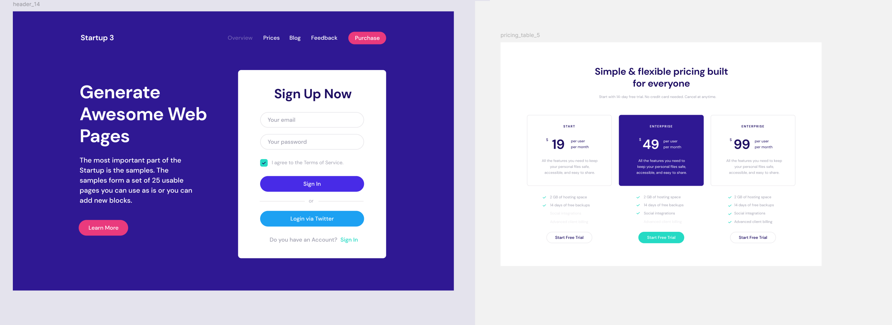

# 🚀 Startup App – Hero + Pricing Table

Aplikacja stworzona na podstawie designu z Figma:



🔗 **Live demo aplikacji:**  
[👉 Otwórz aplikację online](https://start-app-task-9q12.vercel.app/)

---

## 📌 Opis projektu

Aplikacja typu landing page zawiera dwa główne widoki:

- `Hero` – sekcja startowa z nagłówkiem i formularzem rejestracji (komponent **header_14**).
- `Pricing` – tabela z planami subskrypcyjnymi (komponent **pricing_table_5**), widoczna tylko po zalogowaniu użytkownika.

---

## 🧪 Wymagania wstępne

- Node.js w wersji 18 lub wyższej

---

## 🚀 Instalacja aplikacji lokalnie

Aby uruchomić aplikację na swoim komputerze, wykonaj poniższe kroki:

### 1. **Zainstaluj Node.js**

Aplikacja wymaga zainstalowanego Node.js w wersji 18 lub wyższej. Jeśli nie masz Node.js zainstalowanego, pobierz go z oficjalnej strony:  
[Node.js - Pobierz](https://nodejs.org)

### 2. **Sklonuj repozytorium na swój komputer**

Jeśli projekt jest dostępny w repozytorium Git (np. GitHub), sklonuj je na swój komputer, używając poniższego polecenia:

```bash
git clone https://github.com/TwojeRepozytorium.git
```

### 3. **Zainstaluj zależności**

Po sklonowaniu repozytorium, przejdź do katalogu projektu i zainstaluj wszystkie wymagane zależności, uruchamiając:

```bash
npm install
```

### 4. **Uruchom aplikację lokalnie**

Aby uruchomić aplikację, wpisz poniższe polecenie:

```bash
npm run dev
```

Po kilku sekundach aplikacja powinna być dostępna pod adresem `http://localhost:5173/` w przeglądarce.

### 5. **Dodatkowe opcje**

Jeśli chcesz sformatować kod przed rozpoczęciem pracy, użyj poniższego polecenia:

```bash
npm run format
```

To wszystko! Aplikacja powinna działać lokalnie na Twoim komputerze.

---

## 🛠 Stack technologiczny

- **React** + **React Router** – routing i komponenty
- **SCSS Modules** – modularne stylowanie
- **Framer Motion** – animacje komponentów
- **React Context API** – zarządzanie stanem logowania
- **React Toastify** – powiadomienia toast
- **Prettier** – automatyczne formatowanie kodu

---

## 💡 Kluczowe funkcjonalności

Pewnie! Oto poprawiona i doprecyzowana wersja komentarza:

---

### 🔹 Hero Section (`header_14`)

- ✅ Pełna responsywność (mobile / tablet / desktop)
- ✅ Animowane wejścia komponentów (`framer-motion`)
- ✅ Formularz rejestracji z walidacją:
  - poprawna składnia adresu e-mail,
  - hasło: minimum 6 znaków,
  - wymagane zaznaczenie zgody na regulamin (checkbox).
- ✅ Przycisk `Sign In`:
  - symuluje logowanie (bez użycia `axios`, tylko lokalna logika),
  - działa przy poprawnej walidacji: prawidłowy e-mail i hasło (min. 6 znaków),
  - po zalogowaniu ustawia `loggedIn = true`,
  - blokuje wielokrotne klikanie w trakcie "logowania",
  - scenariusze błędów (np. niepoprawny email lub zbyt krótkie hasło),
  - powiadomienia (`react-toastify`) informują o sukcesie lub błędach.

---

### 🔹 Pricing Table (`pricing_table_5`)

- ✅ Widoczna tylko po zalogowaniu (`loggedIn === true`)
- ✅ Dostosowanie do różnych rozdzielczości ekranów
- ✅ Animacje przejść (`framer-motion`)
- ✅ Interaktywne przyciski i efekty hover

---

## 🔐 Walidacja i symulacja "fake API"

Logowanie jest symulowane – aplikacja nie korzysta z prawdziwego API. Zamiast tego wykorzystywana jest funkcja z opóźnieniem (setTimeout) oraz warunkowa logika oparta na wpisanym adresie e-mail.

Aby zalogowanie zadziałało:

- Podaj email o poprawnej składni,
- Wprowadź hasło (min. 6 znaków),
- Zaznacz checkbox z akceptacją regulaminu.

---

## 🧠 Zarządzanie stanem – `AuthContext`

Logika autoryzacji użytkownika oparta jest na kontekście Reacta:

```ts
interface AuthContextType {
  loggedIn: boolean;
  login: () => void;
  logout: () => void;
}
```

---

## 📁 Struktura katalogów projektu

```
src/
├── components/
│   ├── CheckboxFiled/
│   │   ├── CheckboxFiled.motion.ts
│   │   ├── CheckboxFiled.styles.scss
│   │   ├── CheckboxFiled.tsx
│   │   └── CheckboxFiled.types.ts
│   ├── Hero/
│   │   ├── Hero.motion.ts
│   │   ├── Hero.styles.scss
│   │   ├── Hero.tsx
│   │   └── Hero.types.ts
│   ├── InputField/
│   │   ├── InputField.motion.ts
│   │   ├── InputField.styles.scss
│   │   ├── InputField.tsx
│   │   └── InputField.types.ts
│   ├── Navbar/
│   │   ├── Navbar.motion.ts
│   │   ├── Navbar.styles.scss
│   │   ├── Navbar.tsx
│   │   └── Navbar.types.ts
│   ├── PricingPlans/
│   │   ├── PricingPlans.motion.ts
│   │   ├── PricingPlans.styles.scss
│   │   ├── PricingPlans.tsx
│   │   └── PricingPlans.types.ts
│   ├── PricingTable/
│   │   ├── PricingTable.motion.ts
│   │   ├── PricingTable.styles.scss
│   │   ├── PricingTable.tsx
│   │   └── PricingTable.types.ts
│   └── SignInForm/
│   │   ├── SignInForm.motion.ts
│   │   ├── SignInForm.styles.scss
│   │   ├── SignInForm.tsx
│   │   ├── SignInForm.types.ts
│   │   └── SignInForm.validation.ts
├── context/
│   ├── AuthContext.tsx
│   └── AuthContext.types.ts
├── data/
│   └── pricingPlansData.ts
├── hooks/
│   ├── useAuth.ts
│   ├─  useSignInForm.ts
│   └── useWindowsSize.ts
├── routes/
│   └── ProtectedRoutes.tsx
├── pages/
│   ├── Hero.tsx
│   └── PricingTable.tsx
├── routes/
│   └── ProtectedRoute.tsx
├── styles/
│   ├── base/
│   │   ├── font.scss
│   │   ├── global.scss
│   │   ├── mixin.scss
│   │   ├── reset.scss
│   │   └── variables.scss
│   ├── ui/
│   │   ├── button.scss
│   │   └── spinner.scss
│   └── main.scss
│
├── App.tsx
├── index.css
└── main.tsx
```

---

## ✍️ Autor

**Jakub Barszcz**

```

```
